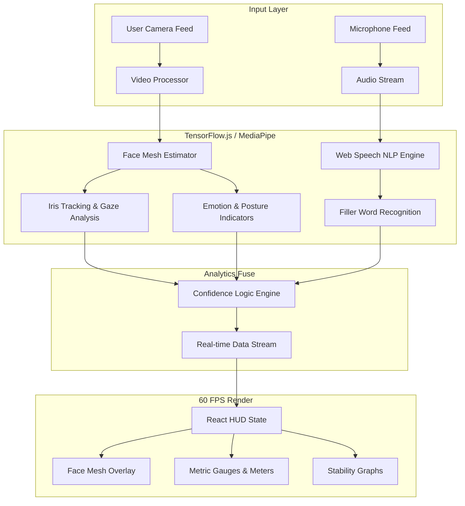

# 🌌 Zenith Neural-Insight 🧠

The Intersection of Physics-Driven Design & AI-Powered Human Analytics.

## 🏗️ System Architecture

The following diagram illustrates the high-performance pipeline used for real-time behavior analysis without blocking the UI thread.

### Technical Detail: The Pipeline
1. **Frame Capture**: Camera frames are captured at 30-60 FPS via the `Camera Utils` library.
2. **Landmark Detection**: MediaPipe's `FaceMesh` (running on WebGL via TensorFlow.js) extracts 478 3D facial landmarks.
3. **Gaze Calculation**: The relative position of the irises (landmarks 468-477) is compared against the eye frame to determine gaze focus.
4. **Vocal Processing**: The `Web Speech API` processes interim audio transcripts to identify specific linguistic patterns (fillers).
5. **State Synchronization**: All metrics are aggregated into a single React state object, triggering atomic updates to the high-tech SVG/Canvas HUD components.

---
*Developed by Touseef Panjtan | Alias: Orewa_Zenith*